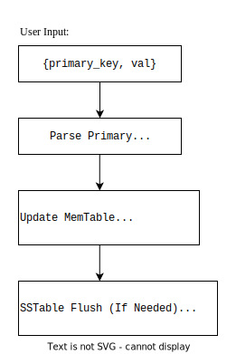
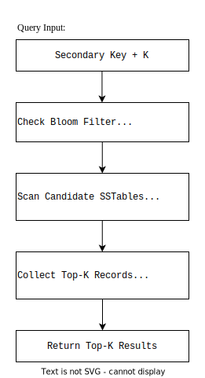
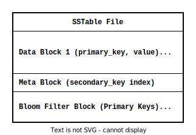
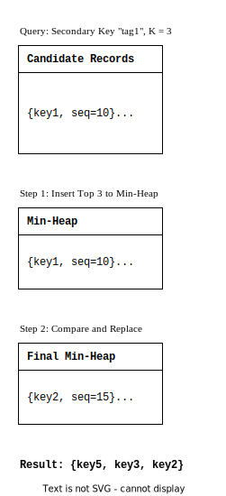

### **实验计划说明报告：基于 `embedded_secondary-index` 的 `LevelDB` 实现及实验**

------

#### **1. 实验背景**

LevelDB 是一个高性能的持久化键值存储引擎，提供简单的 `API` 用于高效的读写操作。然而，传统 `LevelDB` 仅支持基于主键的快速查询，而无法直接支持对二级属性的查询需求。在许多场景（如搜索系统或复杂索引系统）中，需要支持高效的二级索引查询。

本实验计划基于 `embedded_secondary-index` 的设计扩展了 `LevelDB`，支持通过嵌入式布隆过滤器实现的二级索引查询，并引入了 Top-K 查询功能以提升二级属性查询的实用性和效率。

------

#### **2. 实验目标**

- 实现一个支持二级索引查询的 `LevelDB` 扩展版本。
- 验证嵌入式二级索引的设计在读写性能和查询效率上的优越性。
- 测试支持二级索引查询的数据库在 Top-K 查询功能上的性能表现。

------

#### **3. 系统设计**

本实验采用 **`embedded_secondary-index`** 的实现方式，将二级索引嵌入到 `LevelDB` 的原有数据结构中。以下是系统的核心设计：

##### **3.1 数据结构设计**

1. **`MemTable`**：
   - 在内存中维护主键与二级属性的数据映射关系。
   - 对二级属性构建布隆过滤器以提高查询效率。
2. **`SSTable`**：
   - 每个 `SSTable` 包含多个数据块（存储键值对）、元数据块（记录索引信息）和布隆过滤器块（分别用于主键和二级属性的快速过滤）。
   - 数据写入磁盘时，布隆过滤器被嵌入到 `SSTable` 中，避免额外的索引文件。
3. **布隆过滤器**：
   - 对每个数据块的二级属性计算布隆过滤器位串。
   - 通过内存中加载的布隆过滤器快速筛选可能包含目标数据的块，减少磁盘 IO。

##### **3.2 查询算法设计**

1. **Top-K 查询**：
   - 查询时，先通过布隆过滤器筛选出可能的 `SSTable` 和数据块。
   - 使用小顶堆保存查询结果，根据 `sequence_number`（插入顺序）排序，最终返回最近的 K 条记录。
2. **层次化查询流程**：
   - 优先从 `MemTable` 查询；
   - 若未命中，则逐层遍历 `SSTable`。

------

#### **4. 实验步骤**

##### **4.1 系统实现**

1. 修改 `LevelDB` 的源码以支持二级索引嵌入：
   - 更新 `SSTable` 数据块结构，增加布隆过滤器支持；
   - 修改 `Write` 和 `Flush` 流程，嵌入二级索引信息。
2. 扩展数据库的 `API`：
   - 实现二级索引的查询接口（`RangeLookUp` 和 `Top-K LookUp`）。
3. 使用 Google Test 编写单元测试，验证功能正确性。

##### **4.2 计划性能测试**

1. **数据准备**：

   - 生成包含主键和二级属性的模拟数据集。

   - 数据格式示例：

     ```json
     { 
       "primary_key": "id12345",
       "secondary_key": "tag123",
       "value": "This is a test record."
     }
     ```

2. **测试指标**：

   - 数据写入性能（`QPS`）。
   - 基于二级属性的查询性能：
     - 单次查询耗时；
     - 不同 Top-K 参数下的查询性能；
   - 对比嵌入式二级索引与传统外部索引在查询性能上的表现。

3. **测试工具**：
    计划使用 Benchmark 工具测量数据库的吞吐量与延迟。


------

#### **5. 附录：系统结构图**

1. 下面提供一些建议的结构图，可以清晰说明基于 **`embedded_secondary-index`** 的设计和实现，适合配合实验报告使用：

   ------

   ### **1. 系统整体架构图**

   **图示内容**
    展示 `embedded_secondary-index` 的整体设计，包括主键、二级属性的存储方式，以及布隆过滤器与 `SSTable` 的嵌入关系。

   **图示结构**

   

   - 要点说明：
     1. 二级索引与布隆过滤器紧密嵌入 `SSTable` 的元数据块中，避免外部索引文件的开销。
     2. 查询时，通过布隆过滤器快速过滤非相关 `SSTable`，只访问可能的匹配块。

------

   ### **2. 数据写入流程图**

   **图示内容**
    描述写入数据时如何解析主键和二级属性，并更新布隆过滤器和 `SSTable` 的流程。

   **图示结构**



   - **要点说明**：
      写入过程中，自动解析主键和二级属性，实时更新布隆过滤器，确保写入操作高效完成。

------

   ### **3. 数据查询流程图**

   **图示内容**
    展示基于二级属性查询的具体步骤，包括布隆过滤器筛选、块访问和结果返回。

   **图示结构**



   - **要点说明**：
      布隆过滤器用于筛选目标 `SSTable`，通过小顶堆实现 Top-K 的排序与记录收集，保证查询的效率。

------

   ### **4. `SSTable` 布局示意图**

   **图示内容**
    展示 `SSTable` 内部如何组织主键、二级属性和布隆过滤器的布局。

   **图示结构**



   - **要点说明：**
     1. 每个 `SSTable` 包含数据块（Data Blocks）、元数据块（Meta Block）和布隆过滤器块（Bloom Filter Blocks）。
     2. 二级属性的布隆过滤器和主键布隆过滤器分别存储，提供不同维度的快速索引。

------

   ### **5. Top-K 查询堆排序示意图**

   **图示内容**
    以小顶堆为核心，说明查询结果如何按照时间顺序（`sequence_number`）进行排序。

   **图示结构**



   - **要点说明**：
      查询过程中，维护一个固定大小的小顶堆，仅保留最近的 K 条记录，大幅提高排序效率。

------

